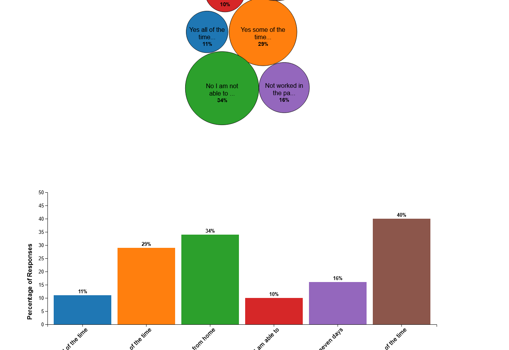

  

# Data Visualisations on Working From Home Sentiment / Numbers

XX

## Description

Utilising HTML, CSS, JS and D3.js I have created some visualisations of the data around working from home. I have developed a bubble chart, bar chart and treemap.

## Deployment

The site is deployed on GitHub pages:

https://jamesrobertsutcliffe.github.io/wfh-data-viz/

## Acknowledgments

- https://tableconvert.com/excel-to-json for allowing me to seamlessly convert excel data to a javascript object.
- The Office of National Statistics for providing the data
